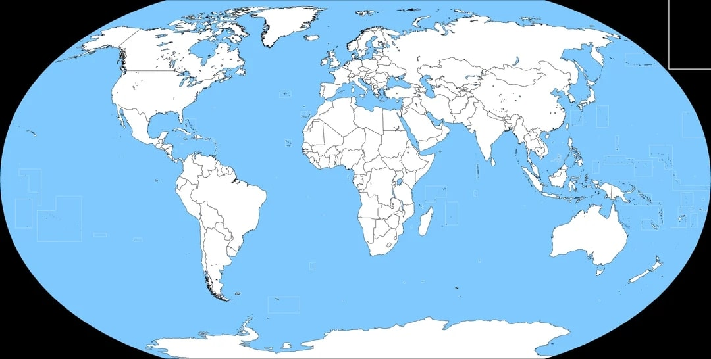

<main>
    
    <!--  -->
      TODO: Need to add css
    <map name="workmap">
        <area shape="circle" coords="34,44,270,350" alt="" href="">
        <area shape="circle" coords="290,172,333,250" alt="" href="">
        <area shape="circle" coords="337,300,44" alt="" href="">
    </map>
      Datasets:
    
    

        
{{ dataset.title }}

        
 {{ dataset.description }} 

        
            <a href="{{ dataset.linkDownload }}">Link to Download</a>
        
            <a>Upon Request to Author</a>
        
        
            <a href="{{ dataset.linkPaper }}"> Link to a Paper Using Dataset</a>
        
        <ul>
            
            <li>{{ other }}</li>
            
        </ul>
    

    

   
</main>