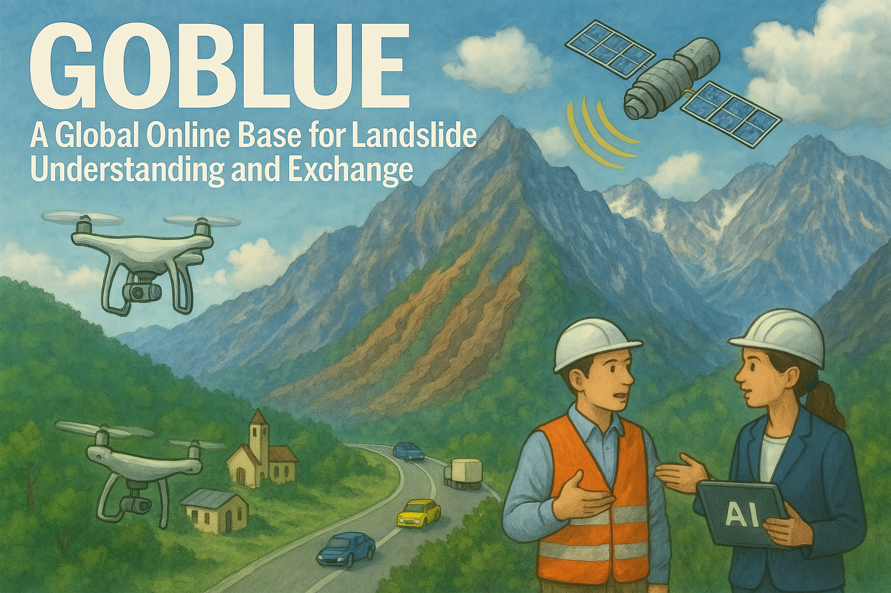
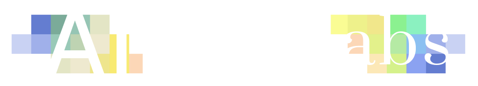

<head>
</head>

<main>
    

        
        

        <a href="{{ '/form' | absolute_url }}" class="upload-btn">
            <button>Upload Your Own Data</button>
        </a>
        <!-- <h2>AI Generated Image</h2> -->
    

    

        

            <h1>
                GOBLUE: 
                A Global Online Base for Landslide Understanding and Exchange
            </h1>
        

        

            

                

                    <h2>Background</h2>
                    

                    Landslides pose a significant and growing threat to mountainous regions worldwide, exacerbated by urbanization, climate change, and population growth. Globally, landslides caused immense human suffering between 1998-2017, affecting an estimated 4.8 million people and causing over 18,000 deaths, according to the World Health Organization, with climate change projected to increase their frequency. While machine learning (ML) and deep learning (DL) have spurred the development of landslide detection models, progress faces significant challenges. Many existing models are region- and type-specific, demonstrating poor or unverified cross-regional generalization. Furthermore, their development often relies on extensive ground truth landslide inventories, which require substantial resources to create, limiting model training in data-scarce regions. The lack of comprehensive, globally representative, and easily accessible datasets currently hinders the creation of robust, generalizable models, including potentially powerful foundation models.
                    

                

                

                    <h2>What We've Done So Far</h2>
                    

                    Inspired by large-scale dataset efforts like ImageNet and the rapid advancements in large language models, and to address these critical gaps, we have developed an open-access, continuously updated website hosting a database that aggregates freely available landslide datasets. This repository provides detailed attributes for each dataset, including: the number of landslide records, inventory type (point/polygon), data resolution, spatial coverage (country/region), model input factors (e.g., satellite optical imagery, land use type, vegetation indices, elevation), ML/DL model used, data splitting methodology (e.g., train/validation/test ratios), and whether cross-regional validation was performed. Downloadable links are provided for direct data access. In addition, the website features an interface enabling the global research community to upload their own datasets, fostering a collaborative effort to build this comprehensive resource. Moreover, the website will be regularly updated with information regarding relevant conferences, seminars, and workshops focused on landslide research.
                    

                

                

                    <h2>What's Next</h2>
                    

                    Our next step will leverage this aggregated data to develop a large-scale landslide detection model with better generalization ability. We plan to apply and adapt this model to specific regions of interest, such as Nepal, utilizing techniques like transfer learning combined with limited local data to predict both historical landslide occurrences and identify potentially unstable slopes prone to future failure.
                    

                

            

            <!-- Arrows -->
            <button class="carousel-prev">←</button>
            <button class="carousel-next">→</button>
        

    

    

        <h1>Partners</h1>
    

    

        

            <!-- Replace src values with paths to your images -->
            
            
            
            
            
            <!-- Copies -->
            
            
            
            
            
        

    

</main>

