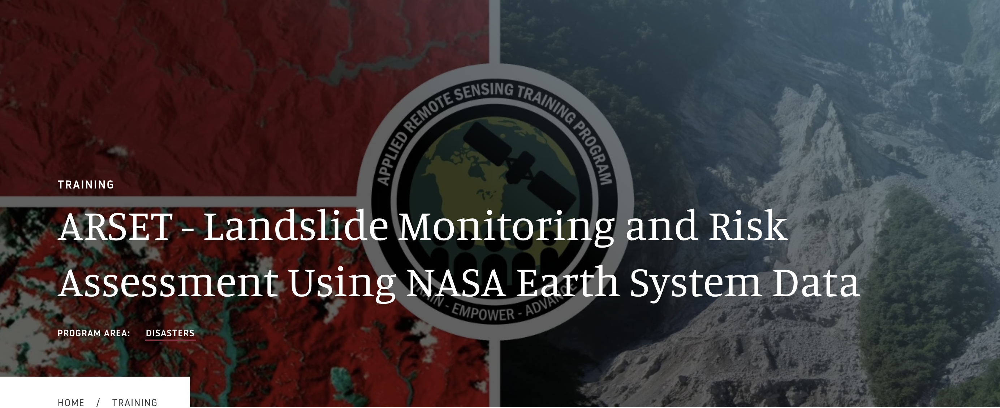
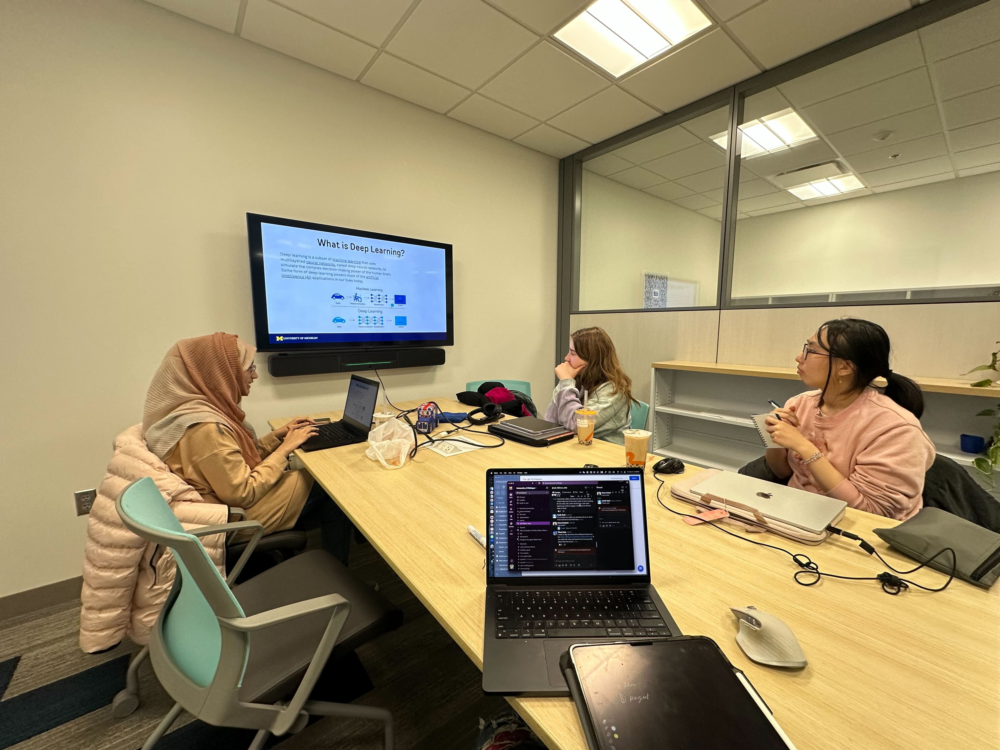
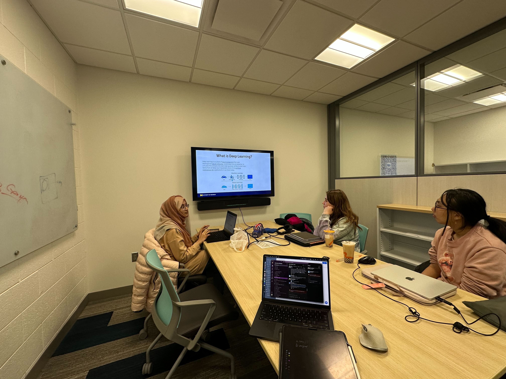

<main>
    

        <h2>NASA Applied Remote Sensing (ARSET)</h2>
        March 11, 13, 18, 2025
        <a href="https://appliedsciences.nasa.gov/get-involved/training/english/arset-landslide-monitoring-and-risk-assessment-using-nasa-earth">Learn More</a>
        Conference
        
A three-part introductory training that covers a number of topics related to landslides, demonstrating a wide variety of NASA Earth science data uses to characterize landslides and their impacts.

        
Part 1: Remote Sensing for Landslide Science and Disaster Planning

        
Part 2: Mapping Landslide Occurrence Using Earth Observations

        
Part 3: Remote Sensing and Landslide Susceptibility

        

            
        

    

    

        <h2>Jowaria Khan's Presents on Geospatial Foundation Models</h2>
        February 14, 2025
        <a href="https://scholar.google.com/citations?user=q6_Cq_cAAAAJ&hl=en">Learn More</a>
        Presentation
        

            
            
        

    

</main>

